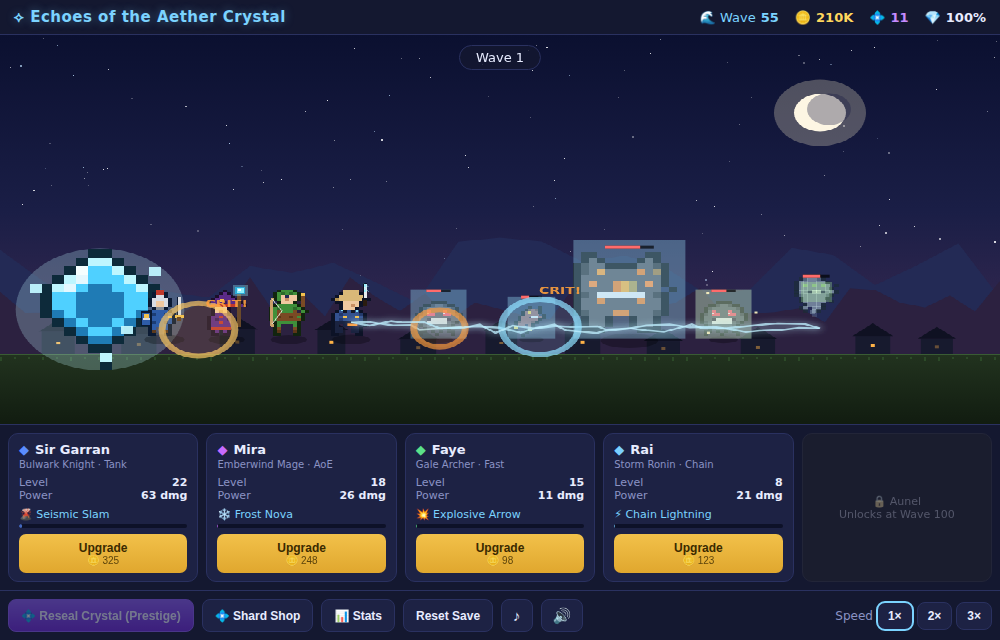

# ⟡ Echoes of the Aether Crystal

A browser-based **idle / incremental defense game** (방치형 디펜스 게임) with a
Japanese-RPG flavor. Four heroes hold the line at the village of Luminel,
auto-battling endless waves of the Umbral Tide to protect the Aether Crystal.
No installs, no build step — open `index.html` and play.



## How to play

Just open **`index.html`** in any modern browser. Everything is self-contained
(pure HTML + canvas + JavaScript, no external assets or libraries). Progress is
saved automatically to `localStorage`, including offline earnings while the tab
is closed.

The game plays itself — the only decision is **where to spend your gold**:

- Waves auto-advance; heroes auto-attack; gold accrues per kill.
- Tap a hero card to **recruit / upgrade** them.
- Every **5th wave** is a **boss** (8× HP, 10× gold) that acts as a soft wall.
- Come back later to collect **offline earnings** (50% rate, capped at 8h).
- When progress stalls, **Reseal the Crystal (Prestige)** for permanent **Aether
  Shards**, then spend them in the **Shard Shop** for permanent boosts.

## Heroes & their AoE skills

Every hero auto-attacks **and** auto-casts one area skill on its own cooldown.
All attacks and skills are drawn on screen (projectiles, novas, lightning).

| Hero | Archetype | Auto skill | Effect |
|------|-----------|-----------|--------|
| **Sir Garran** | Bulwark Knight (tank) | 🌋 Seismic Slam | AoE damage to all enemies |
| **Mira** | Emberwind Mage (W10) | ❄️ Frost Nova | AoE damage **+ freezes/slows** all enemies |
| **Faye** | Gale Archer (W25) | 💥 Explosive Arrow | Arrow that **explodes** for radial AoE |
| **Rai** | Storm Ronin (**W50**) | ⚡ Chain Lightning | Arcs between up to 5 enemies |
| **Aunel** | Dawn Healer (W100) | 🌅 Dawn Blessing | Big Crystal heal + holy AoE + party damage buff |

## Enemy types

`normal` · `fast` · `runner` (very fast, fragile) · `tank` · `golem` (huge HP) ·
`wraith` (floats, **immune to slow**) — introduced progressively as waves climb —
plus a **boss** every 5th wave.

## Sound

All audio is **synthesized with the Web Audio API** (no files): per-skill SFX
(ice, explosion, lightning, …), upgrade/wave/boss/prestige cues, and a looping
background theme. Toggle music (♪) and mute (🔊) from the controls. Audio starts
on your first tap/click (browser autoplay policy).

## Mobile

Responsive canvas, touch-friendly tap targets, no tap-delay, and a layout that
reflows on narrow / portrait screens.

## Extras

- **Tap a hero** on the battlefield to instantly cast their skill when it's
  ready (a glowing ring marks a ready hero).
- **Critical hits** — every attack can crit for ×2.5 damage; buy the **Keen
  Edge** shard upgrade to raise your crit chance.
- **Golden enemies** — rare shimmering foes that drop a huge gold windfall.
- **Boss health bar** across the top during boss waves.
- **📊 Stats panel** — best wave, enemies defeated, lifetime gold, shards, crit chance.

## Design & balance

Core formulas (wave index `w`):

- **Enemy HP:** `10 × 1.12^(w-1)`
- **Enemies per wave:** `min(5 + ⌊w/3⌋, 20)`, one spawn / 0.8s
- **Gold per kill:** `⌈2 × 1.10^(w-1)⌉` (reward growth trails HP growth → upgrading is mandatory)
- **Hero damage:** `base × (1 + 0.25 × level)`
- **Upgrade cost:** `⌈base × 1.15^level⌉` (geometric curve)
- **Prestige shards:** `⌊√(lifetimeGold / 1,000,000)⌋`, +2% permanent damage each

Milestones: W10 unlock Mira · W25 Faye · W100 Aunel · W500 fully reseals the
Crystal (endless mode continues).

## Files

| File | Contents |
|------|----------|
| `index.html` | Markup, HUD, hero/skill panel, audio & mobile styling |
| `game.js` | Game engine: waves, combat, skills + visible FX, enemy types, economy, save/load, offline, prestige, shop |
| `sprites.js` | Pure canvas pixel-art renderers for every hero (incl. Rai), enemy type, boss, the Crystal, and the parallax night background |
| `audio.js` | Web Audio synthesized SFX + background music |

## Built with a multi-agent workflow

- **Agent A** — researched the genre (reference: *The Tower – Idle Tower Defense*) and core idle-defense mechanics.
- **Agent B** — designed the scenario, difficulty curve, and all balance formulas.
- **Agent C** — created the JRPG pixel-art sprite module (`sprites.js`).
- **Agent D** — code review; caught 5 correctness bugs (all fixed).
- **Agent E** — built the engine and integrated everything.

## Development / verification

The game needs no dependencies to run. The `*.mjs` scripts drive a headless
Chromium (via `playwright-core`) to smoke-test the game loop, economy, prestige,
and the specific bug fixes:

```
npm install playwright-core
node verify.mjs    # full smoke test (waves, upgrades, prestige, shop)
node verify2.mjs   # targeted regression tests for fixed bugs
```
